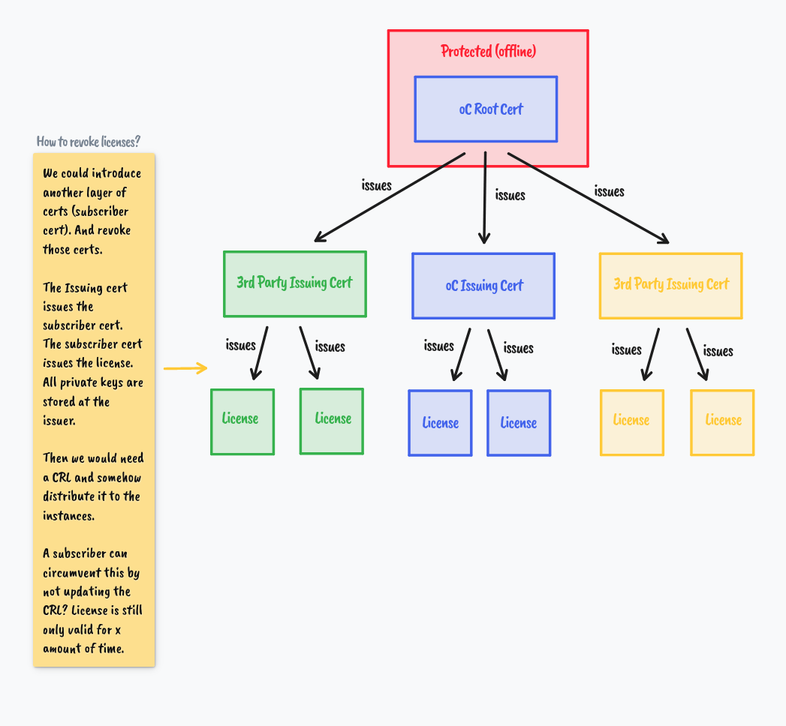

# Documentation of the ocis-license library

This document aims to explain the concepts implemented in this library.

## Certificates and Signing Keys

As can be seen in the figure above there are multiple instances involved in issuing a license. What is not shown in the figure is that each certificate also has a corresponding private key which is used for signing. The certificate doesn't have to be protected only the private key needs the special protection. Let's go over the different certificates one by one to understand why they are needed.

### Root Certificate

The owner of the root certificate acts as the root certificate authority (CA). The CA can issue further certificates. By having a root certificate we can give third parties the option to issue licenses while still being able to verify those licenses. 
If we would only have one certificate, i.e. only the root certificate, to issue licenses and we would want third parties to also issue licenses then we either would need to give them our private key or they would need to generate their own certificate and private key. The first option is bad because we can't control that the third party protects the key as best as possible and the second option is bad since only the third party could then verify the licenses.

The root private key needs to be protected as well as possible because if that key gets stolen it can be used to issue new certificates and licenses.
If issuing new third party certificates is happening many times and maybe even via API requests then we should introduce another layer between the root certificate and the issuing certificates.

### Issuing Certificate

The issuing certificate represents and intermediate CA which can issue licenses. The issuing certificate is issued and signed by the root certificate. If the issuing private key gets compromised the root CA can revoke it and with that invalidate everything which was signed with the compromised key.

The issuing certificate can be given out to third parties so that they deploy their own instance of the ocis-license server.

### License

The license is the actual license which will be used by the ocis license enforcer to restrict the deployment based on information in the license.

Currently the license has the format `base64(json(header)).base64(json(payload))`. The header contains purely technical fields which are relevant for validating and parsing the license but not for any enforcement. The payload contains the actual license information and is the part which is signed by the immediate CA (the issuer).

## Validating the license

The license can be validated via the following steps:

1. Split the license into the header and payload parts.
1. Decode the header and the payload
1. Take the `PayloadSignature` and `Issuer Certificate` (not the private key) from the header.
1. Verify the signature on the issuer certificate using the root certificate.
	1. If the verification fails the license is invalid.
1. Verify the `PayloadSignature` using the issuer certificate.
	1. If the verification fails the license is invalid.
1. If both verifications succeeded the license is valid.

All those steps are being handled when calling `license.Verify`.

When we want to verify the licenses in ocis we need to include the root certificate in the ocis binary.

### Drawbacks

If someone wants to circumvent the license check they could replace the root certificate in the binary with their own certificate and issue their own licenses. This would take some effort but is technically possible. 

Preventing this is not straight forward and to some degree not possible because someone who is able to replace the binary data of the certificate can also remove the certificate check from the binary.

## Revoking licenses

The two layer approach doesn't provide a way to revoke a license before it expires. One possible way to implement revokation would be to add another layer of certificates between the issuer and the license, let's call it the subscriber certificate.

The issuer would issue the subscriber certificate and the subscriber certificate would then issue the license. A subscriber certificate would represent the entity who bought a license but they would not possess the certificate and private key. They would still be stored at the issuer.
If we then want to revoke the license we could revoke the subscriber certificate which would then indirectly revoke the license.
This would also add another step to the verification process, namely checking if a certificate was revoked by checking a Certificate Revokation List (CLR) or by other means. This would also require the deployments to regularly check for CLR updates, which might not be possible for offline setups where the ocis instance doesn't have a connection to the internet/our license api.